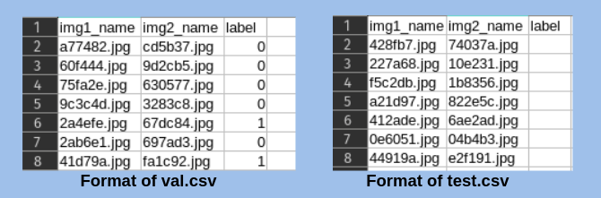

# Summer Challenge on Writer Verification

1. <a href="#introduction">Introduction</a>
2. <a href="#dataset">Dataset</a>
3. <a href="#starter-code">Starter Code</a>
4. <a href="#evaluation">Evaluation</a>

 
---
## Introduction
The Writer Verification challenge is a competition that involves identifying whether a given pair of handwritten text samples was written by the same person or two different persons. In the accompanying Github repository, you will find starter code to help you get started on this task.

## Dataset
* The training set consists of 1352 folders, each containing a set of images written by the same person.
* The validation set contains a set of images from 92 different writers, along with a file called 'val.csv' that contains pairs of image names and corresponding labels. A label of 1 indicates that the images were written by the same writer, and a label of 0 indicates that the images were written by different writers.
* Test set contains images from 360 writers. In test.csv you are given name of image pairs. For output, you need to predict the label for given pair of images and submit the csv file in the format by editing the test.csv file.



---

## Starter Code
You can find the starter code [here]()

---

## Evaluation
Your submissions will be evaluated against the ground truth using F1 score and AUC.
* F1 score: A measure of a model's accuracy that considers both precision and recall.
* AUC (Area Under the Curve): A measure of a model's performance that calculates the area under the Receiver Operating Characteristic (ROC) curve.
```
F1 = 2 * (precision * recall) / (precision + recall)
AUC = integral(TPR(FPR^-1)(f)df) where FPR is false positive rate and TPR is true positive rate
```

--- 
For more details, please refer to our site [here](https://ceyxasm.github.io/WVSite/#top)
